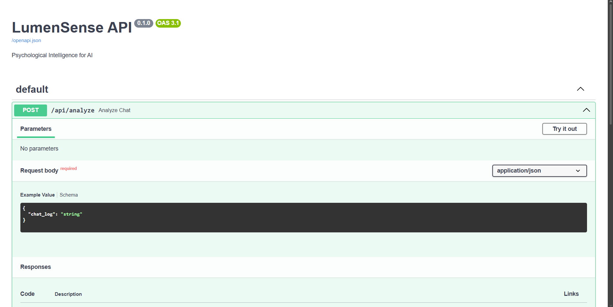
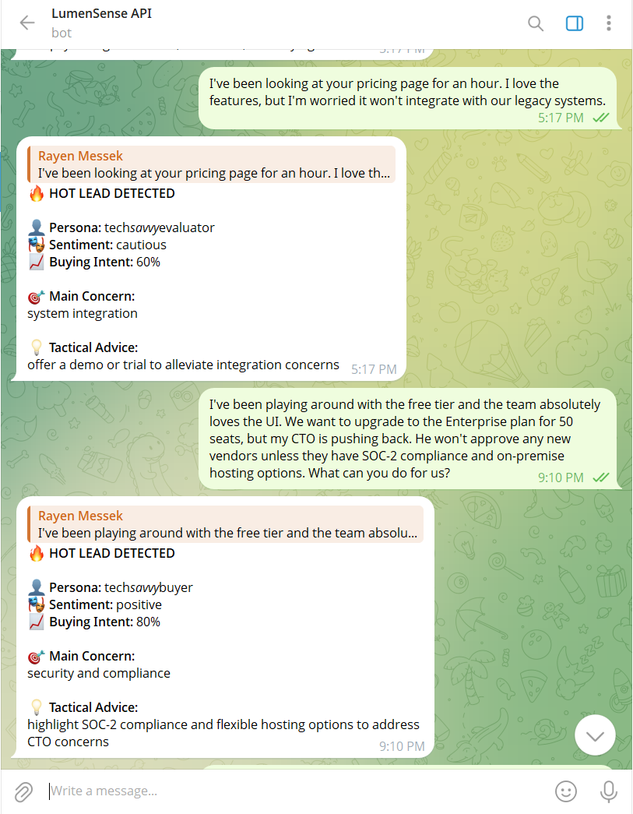

# LumenSense API 🧠
An open-source "Psychological Intelligence" layer for AI agents. 

LumenSense acts as a microservice that analyzes the raw text of a conversation in real-time and feeds your AI agent a "tactical dossier" on how to pivot its strategy based on the user's psychological state.

## 🚀 Features
* **Real-time Psychological Profiling:** Extracts User Persona, Sentiment, and Buying Intent.
* **Tactical Advice Engine:** Gives your chatbot specific instructions on how to close a deal or de-escalate frustration.
* **Sub-second Inference:** Powered by Llama-3.3-70b via the Groq API.
* **Headless Architecture:** Built with FastAPI. It can plug into any platform that can make a POST request.

---

## 🏗️ Architecture Stack
* **Framework:** FastAPI (Python)
* **Validation:** Pydantic
* **AI Engine:** Groq (Llama-3.3-70b-versatile)
* **Deployment:** Serverless on Render

---

## 🔌 Integration Showcase: Telegram Bot (Proof of Concept)

LumenSense is designed as a headless microservice. It doesn't matter where your users are chatting—if your platform can make a POST request, it can have emotional intelligence.

To prove this, we built a lightweight Telegram Bot that consumes the LumenSense API in real-time. 

### How it Works:
1. **The Client:** A Python-based Telegram Bot (`pyTelegramBotAPI`) listens for customer messages.
2. **The Request:** It forwards the raw text to our deployed FastAPI endpoint.
3. **The Response:** The API's Groq/Llama-3 engine analyzes the psychological subtext.
4. **The Result:** The bot formats the JSON dossier and alerts the user (e.g., flagging "Hot Leads" instantly).

### 📸 Live Demo 

**1. The API Documentation (Swagger UI)**


**2. The Telegram Bot in Action**


*(Note: In future updates, we will be releasing drop-in SDKs and webhook templates to make integrating LumenSense into platforms like Discord, Slack, and Zendesk as easy as copy-pasting an API key.)*

---

## 💻 Local Installation & Setup

If you want to run the core API locally, follow these steps:

**1. Clone the repository**
```bash
git clone [https://github.com/ryn-is-not-available/LumenSenseAPI]
cd LumenSenseAPI

```

**2. Create a virtual environment**

```bash
python -m venv venv
venv\Scripts\activate  # On Windows
# source venv/bin/activate  # On macOS/Linux

```

**3. Install dependencies**

```bash
pip install -r requirements.txt

```

**4. Set up Environment Variables**
Create a `.env` file in the root directory and add your Groq API key:

```env
GROQ_API_KEY=your_groq_api_key_here

```

**5. Run the server**

```bash
uvicorn main:app --reload

```

*The API will be available at `http://127.0.0.setup:8000*`
*Interactive Swagger Documentation available at `http://127.0.0.1:8000/docs*`

---

## 📡 API Usage

**Endpoint:** `POST /analyze`

**Request Payload:**

```json
{
  "chat_log": "I've been looking at your pricing page for an hour. I love the features, but I'm worried it won't integrate with our legacy systems."
}

```

**Response Payload:**

```json
{
  "profile": {
    "persona": "Tech-savvy evaluator",
    "sentiment": "Cautious",
    "buying_intent": 60
  },
  "insights": {
    "main_concern": "System integration capabilities",
    "tactical_advice": "Offer a technical demo or free trial to alleviate integration concerns."
  },
  "is_hot_lead": true
}
